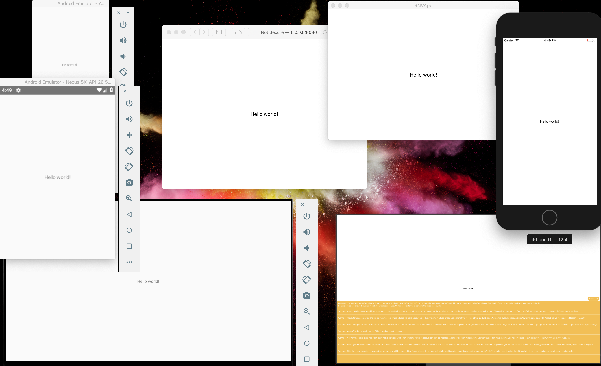

=======================
React-Native in Haskell
=======================

Using `Renative <https://renative.org>`_!
Exploring the design space of how to use Haskell in different environments.
This project is a work-in-progress and meant to be a template or an example for "real" applications.

See also `TODO example <https://github.com/jyrimatti/renative-hs-example-todo>` for a working example. 

Creating a new project
----------------------

1. Fork this repo.
2. Do your Haskell under ./src

Trying out
----------

1. install `Nix <https://nixos.org/nixpkgs/>`_. You should already have it.
2. ``git clone https://github.com/jyrimatti/renative-hs.git``
3. ``./rnv.sh # Use 'rnproject' as project Name``
4. ``./build.sh``
5. ``./rnv.sh run -p web``

Addons
------

For addons/plugins you need to add relevant registrations to ./register_addons.js, which is copied once to ./rnproject/src/register_addons.js on project initialization.

Haskell development
-------------------

Shell with all the project dependencies

>>> ./shell.sh

Launch you default editor with all the project dependencies

>>> PKGS=./default.nix sh <(curl https://hs.lahteenmaki.net/editor)

Building and Continuous Compilation
----------------------

>>> ./build.sh
>>> ./cleanbuild.sh
>>> ./cc.sh

Issues
---------

- React-native doesn't seem to work on AndroidWear in Debug-mode (https://github.com/facebook/react-native/issues/25580). Release mode works fine.
